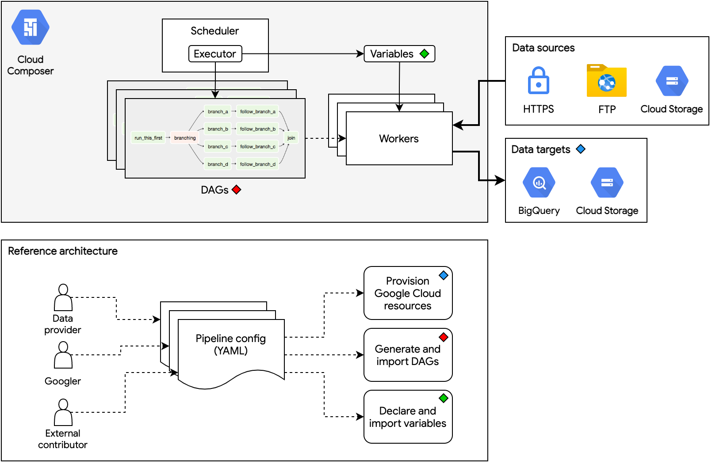
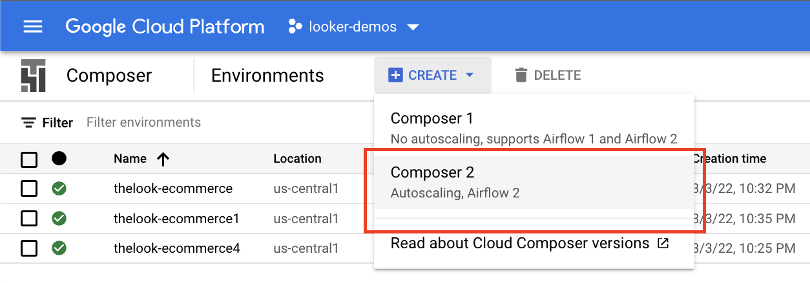
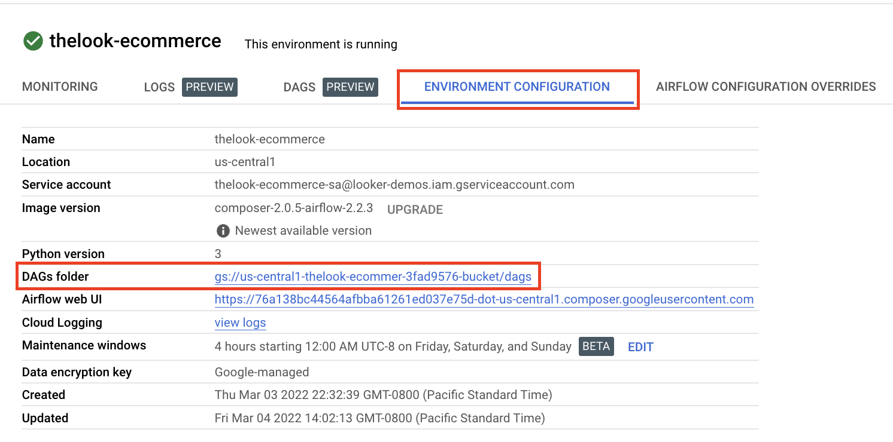
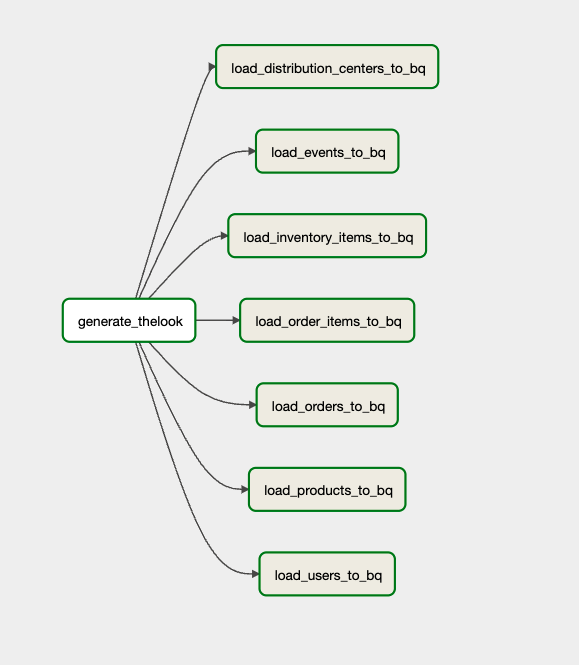
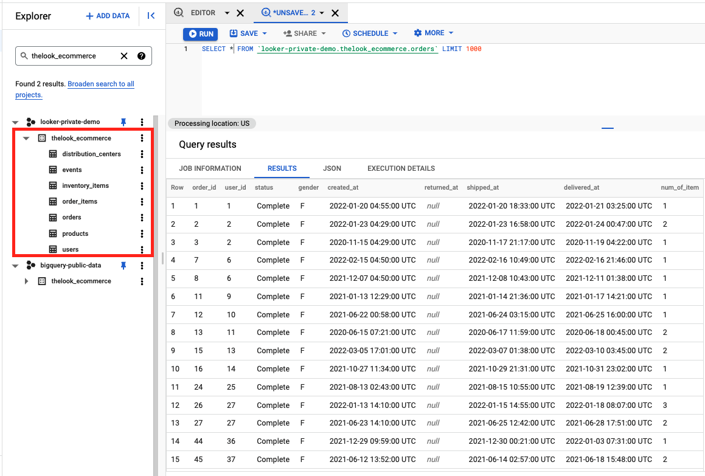

# Retail E-Commerce Dataset Pipeline

We're using the [BQ Public Datasets Pipeline](https://github.com/GoogleCloudPlatform/public-datasets-pipelines) to deploy a cloud-native, data pipeline architecture for onboarding datasets within Argolis.

# Overview



# Requirements

- Access to [Cloudtop Env](https://support.google.com/techstop/answer/2662330?hl=en&ref_topic=2683844)
- Access to [Argolis Env](https://docs.google.com/document/d/1bWTzNttV3guOF_pO0Yt9RHk8IPZR5E8DWc7Sbqk3avA/preview)
- Ensure Argolis Env is set up to allow for creation of Composer 2 env. More context found [here](https://docs.google.com/document/d/1hkaIOJLsmOqpodfJ7o-sFYcgCqv4u3FdiSotdW-udhE/edit#heading=h.pa15kw7vycrj)
- Python `>=3.6.10,<3.9`. We currently use `3.8`. For more info, see the [Cloud Composer version list](https://cloud.google.com/composer/docs/concepts/versioning/composer-versions).
- Familiarity with [Apache Airflow](https://airflow.apache.org/docs/apache-airflow/stable/concepts/index.html) (`>=v2.1.0`)
- [pipenv](https://pipenv-fork.readthedocs.io/en/latest/install.html#installing-pipenv) for creating similar Python environments via `Pipfile.lock`
- [gcloud](https://cloud.google.com/sdk/gcloud) command-line tool with Google Cloud Platform credentials configured. Instructions can be found [here](https://cloud.google.com/sdk/docs/initializing).
- [Terraform](https://learn.hashicorp.com/tutorials/terraform/install-cli) `>=v0.15.1`
- [Google Cloud Composer](https://cloud.google.com/composer/docs/concepts/overview) environment running [Apache Airflow](https://airflow.apache.org/docs/apache-airflow/stable/concepts.html) `>=2.1.0` and Cloud Composer `>=2.0.0`. To create a new Cloud Composer environment, see [this guide](https://cloud.google.com/composer/docs/how-to/managing/creating).

# Environment Setup

### Cloudtop
- SSH into Cloudtop Instance
- Clone this repo

```bash
cd https://github.com/llooker/bq_dataset_pipeline
```

- authenticate to Argolis via gcloud
- 
```bash
gcloud auth login
gcloud auth application-default login
```


We use Pipenv to make environment setup more deterministic and uniform across different machines. If you haven't done so, install Pipenv using these [instructions](https://pipenv-fork.readthedocs.io/en/latest/install.html#installing-pipenv).

```bash
pipenv install --ignore-pipfile --dev
```

## 1. Create and Configure Composer 2 Enviornment



- Within your Argolis Project create your Composer 2 Enviornment (we're naming ours `thelook-ecommerce` hosted in `us-central1` if you want to follow along)

If there's an issue spinning up a composer env, most likely your Argolis Env isn't set up properly (more context [here](https://docs.google.com/document/d/1hkaIOJLsmOqpodfJ7o-sFYcgCqv4u3FdiSotdW-udhE/edit#heading=h.pa15kw7vycrj))

- Once your Composer 2 Env is up and running (takes ~25 min) you'll want to click into it and [set your enviornment variables](https://cloud.google.com/composer/docs/composer-2/set-environment-variables#console).

| NAME                                   | VALUE                                     |
| -------------------------------------- | ----------------------------------------- |
| AIRFLOW_VAR_GCP_PROJECT                | `Your GCP Argolis Project Name`           |
| GCS bucket of the Composer environment | `Your Composer Enviornment's Bucket Name` |
| AIRFLOW_VAR_AIRFLOW_HOME               | `/home/airflow/gcs`                       |

- Please note that the GCS bucket for your Composer Env can be found by clicking into the environment > Enviornment Configuation tab > DAGs Folder (be sure to just copy the bucket name - don't include any folders)



## 2. Generate Terraform files and actuate GCP resources

On Cloutop within the run the following command from the project root (be sure to replace the placeholders with your environment's values):

```bash
$ pipenv run python scripts/generate_terraform.py \
    --dataset thelook_ecommerce \
    --gcp-project-id $GCP_PROJECT_ID \
    --region $REGION \
    --bucket-name-prefix $UNIQUE_BUCKET_PREFIX \
    --tf-apply
```

| PLACEHOLDER           | Description                                            |
| --------------------- | ------------------------------------------------------ |
| $GCP_PROJECT_ID       | `Your Argolis Project Name`                            |
| $REGION               | `Region where your Composer 2 Enviornment is Deployed` |
| $UNIQUE_BUCKET_PREFIX | `Your Composer Env bucket name`                        |

- This will generate the terrform files and create the infra within your GCP Project (eg. you should now see a dataset named `thelook_ecommerce` with multiple tables defined)

## 3. Generate DAGs and container images

Run the following command from the project root:

```bash
$ pipenv run python scripts/generate_dag.py \
    --dataset thelook_ecommerce \
    --pipeline $PIPELINE
```

| PLACEHOLDER | Description                                                                  |
| ----------- | ---------------------------------------------------------------------------- |
| $PIPELINE   | `Name of your Composer 2 Env - in our example it's called thelook-ecommerce` |

- This will build our Docker Image and upload into [Container Registry](https://cloud.google.com/container-registry) and generate our DAG file using the `pipeline.yaml file`
- Within our Argolis Project, navigate to `Images - Container Registry` and copy the repo name containing our docker image (eg. gcr.io/looker-demos/thelook_ecommerce\_\_run_thelook_kub)

### Dataset-specific variables

- On Cloudtop Navigate to your `.dev/datasets/thelook_ecommerce/pipelines` folder
- Create a new file called `thelook_ecommerce_variables.json`
- Paste in the json below, replacing the `docker_image` value with your envirnment's docker image repository link if needed

```json
{
  "thelook_ecommerce": {
    "docker_image": "gcr.io/looker-demos/thelook_ecommerce__run_thelook_kub"
  }
}
```

## 6. Deploy the DAGs and variables

Back in the project root directory, run the following command:

```
$ pipenv run python scripts/deploy_dag.py \
  --dataset thelook_ecommerce \
  --composer-env $CLOUD_COMPOSER_ENVIRONMENT_NAME \
  --composer-bucket $CLOUD_COMPOSER_BUCKET \
  --composer-region $CLOUD_COMPOSER_REGION
```

| PLACEHOLDER                      | Description                                                                              |
| -------------------------------- | ---------------------------------------------------------------------------------------- |
| $CLOUD_COMPOSER_ENVIRONMENT_NAME | `Name of your Cloud Composer Enviornment - in our example it's claled thelook-ecommerce` |
| $CLOUD_COMPOSER_BUCKET           | `Your Composer Env bucket name`                                                          |
| $CLOUD_COMPOSER_REGION           | `Region your Composer Env is deployed in`                                                |

## 7. Confirm everything is working

- Go to your Airflow Composer Env and view the dag to make sure it's running (takes ~15-25 minutes for the data to be generated and uploaded into BQ)



- Query your BQ table and data!



